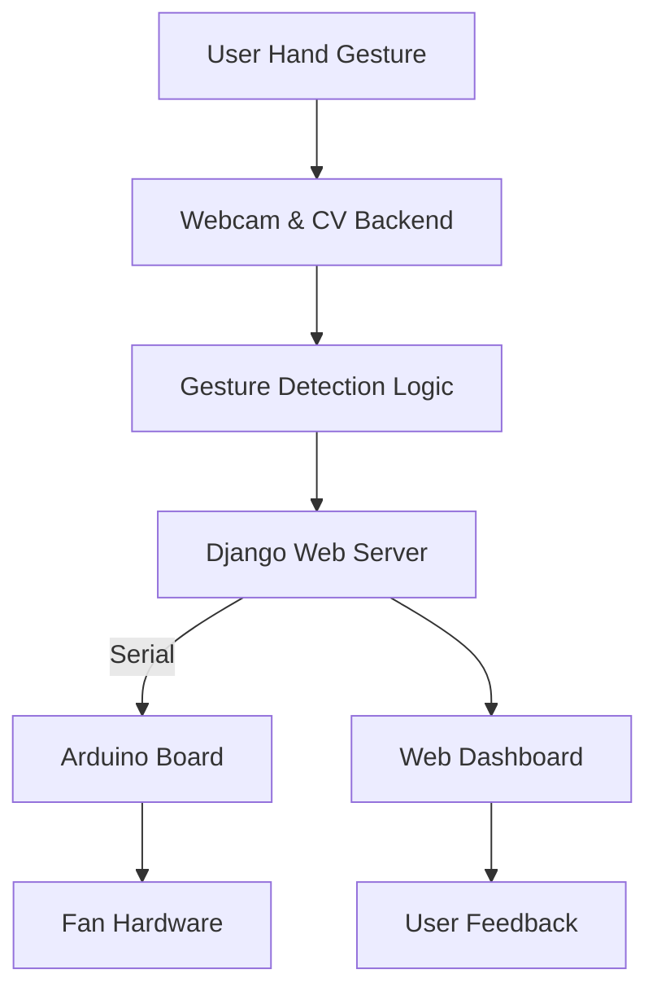

# 🖐️💨 Hand Gesture Fan Controller

Welcome to the **Hand Gesture Fan Controller**—an innovative smart home project that lets you control a fan with nothing but hand gestures! This system fuses computer vision, web technologies, and hardware integration to create a futuristic and accessible smart fan experience.

---

## 📚 Table of Contents

- [Overview](#overview)
- [Features](#features)
- [Live Demo](#live-demo)
- [How It Works](#how-it-works)
- [Gesture Controls](#gesture-controls)
- [System Architecture](#system-architecture)
- [Installation](#installation)
- [Usage](#usage)
- [Technologies Used](#technologies-used)
- [Future Enhancements](#future-enhancements)
- [License](#license)

---

## 🌟 Overview

This project enables you to toggle a fan **ON/OFF** and adjust its speed using simple hand gestures in front of your camera. The system uses computer vision to recognize gestures and communicates with an Arduino-based fan controller, providing real-time feedback via a web dashboard.

**Why?**
- Improve accessibility for everyone, especially for those with limited mobility.
- Add a futuristic touch to home automation!
- Learn and showcase the power of computer vision and IoT integration.

---

## 🚀 Features

| Feature            | Description                                                                                  |
|--------------------|----------------------------------------------------------------------------------------------|
| 🤖 Gesture Control | Use intuitive hand gestures to power the fan and control its speed.                          |
| 🌐 Web Dashboard   | Modern dashboard to view status, control the fan, and see gesture feedback in real-time.     |
| 🔁 Real-Time Sync  | Instant updates on the dashboard when gestures are detected or fan state changes.            |
| 🔌 Arduino Ready   | Easily interfaces with an Arduino for reliable physical fan control.                         |
| ⚡ Speed Slider    | Manually adjust fan speed via the web UI (synchronized with gesture input).                  |
| 🛡️ Error Handling  | Detects Arduino connection issues and provides user feedback.                                |
| 📊 Logging (Planned) | Log fan usage and gesture events for analytics.                                            |

---

## 🎥 Live Demo

*Coming Soon!* 

---

## 🧠 How It Works

1. **Hand Detection:**  
   A webcam captures your hand gestures using OpenCV and MediaPipe.

2. **Gesture Recognition:**  
   The backend analyzes finger positions to interpret gestures such as "Turn On", "Turn Off", "Speed Up", and "Speed Down".

3. **Command Relay:**  
   Detected gestures are sent to an Arduino over serial communication, which then controls the fan.

4. **Web Dashboard:**  
   A Django-powered dashboard displays the current state, lets you control the fan, and provides real-time feedback.

---

## ✋ Gesture Controls

| Action        | Gesture Emoji | Description                       |
|---------------|:------------:|-----------------------------------|
| Turn On Fan   | 🤘           | Show "rock on" gesture            |
| Turn Off Fan  | 🤚           | Show open palm                    |
| Speed Up      | 👍           | Show thumbs up                    |
| Speed Down    | 👎           | Show thumbs down                  |

> **Tip:** The dashboard displays gesture instructions and real-time gesture feedback!

---

## 🏗️ System Architecture



---

## ⚙️ Installation

1. **Clone the Repository**
   ```bash
   git clone https://github.com/KeshanKaushalya/smart_home_controller.git
   cd smart_home_controller
   ```

2. **Backend Setup**
   - Ensure you have Python 3.x and pip.
   - Install dependencies:
     ```bash
     pip install -r requirements.txt
     ```
   - (Optional) Set up a Python virtual environment.

3. **Frontend**
   - Static files are managed via Django; Bootstrap is used for styling.

4. **Arduino**
   - Load the provided Arduino sketch (in `/arduino/` if present) to your Arduino.
   - Connect the Arduino to your computer via USB.

---

## ▶️ Usage

1. **Start the Django Server:**
   ```bash
   python manage.py runserver
   ```

2. **Access the Dashboard:**
   - Open `http://127.0.0.1:8000/` in your browser.

3. **Use Hand Gestures:**
   - Stand in front of your webcam and try the gestures listed above.
   - Watch the fan respond in real-time!

4. **Manual Control:**
   - Use the dashboard buttons and speed slider for direct control.

---

## 🛠️ Technologies Used

| Layer        | Tech Stack                              |
|--------------|-----------------------------------------|
| Backend      | Python, Django, OpenCV, MediaPipe       |
| Frontend     | HTML5, CSS3, JavaScript, Bootstrap      |
| Hardware     | Arduino Uno/Nano, DC Fan                |
| Communication| Serial (pySerial)                       |

---

## 🚧 Future Enhancements

- Add gesture customization and calibration.
- Fan usage and gesture event logging.
- Multi-device/room support.
- Mobile-friendly dashboard.
- Integration with voice assistants.

---

## 📄 License

MIT License (or update if your project has a specific license).

---

> **Made with ❤️ by [KeshanKaushalya](https://github.com/KeshanKaushalya)**
